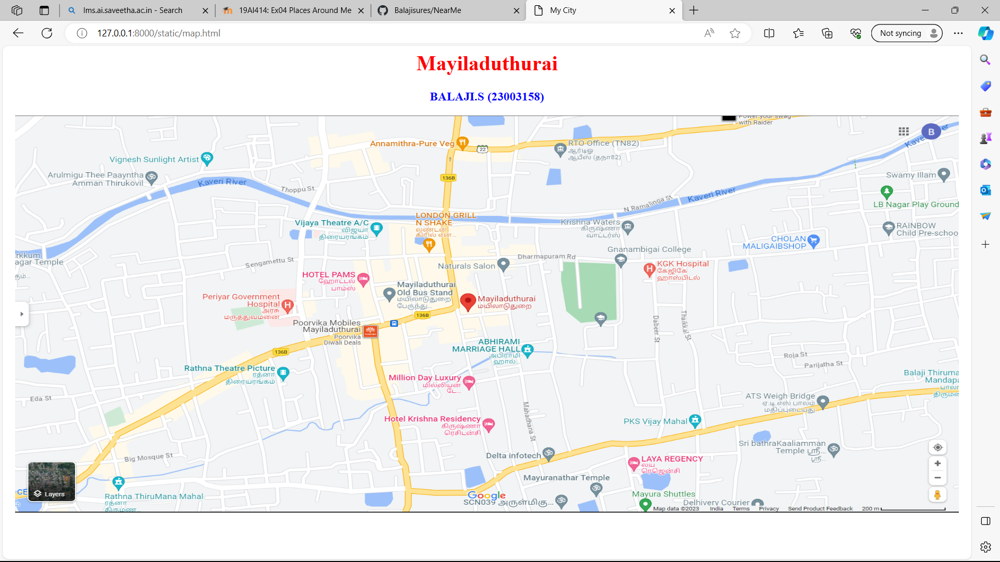
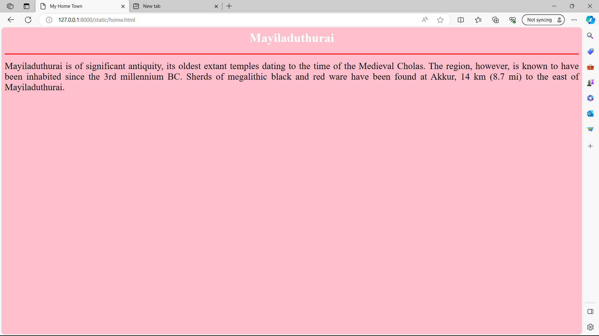
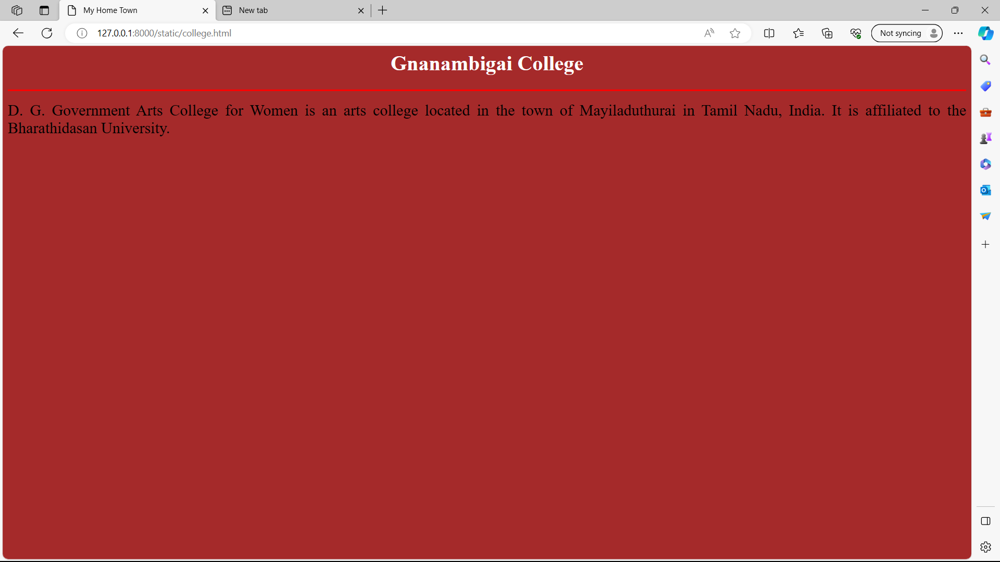
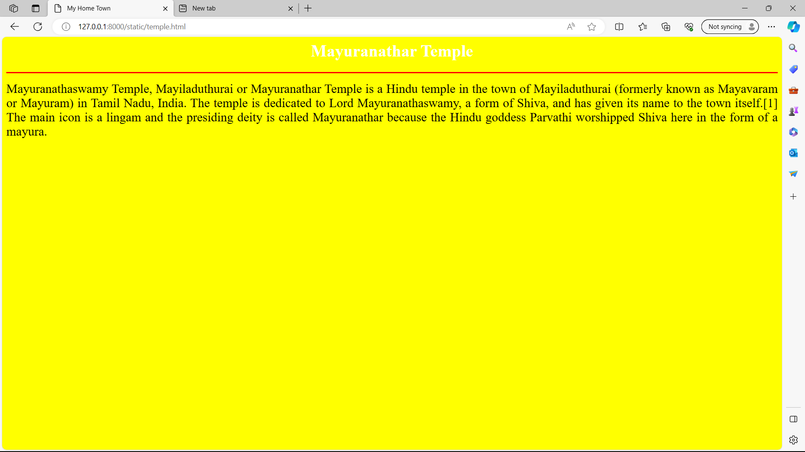
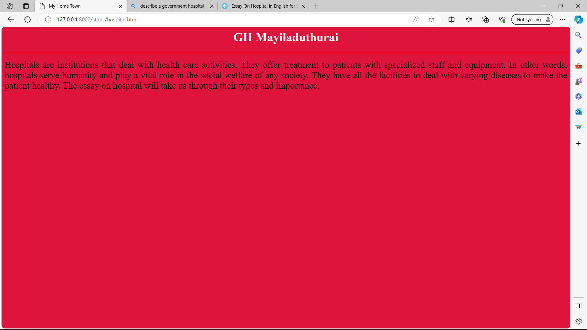
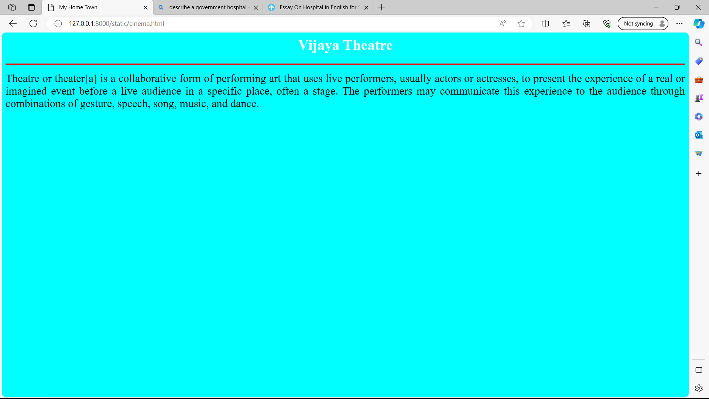

# Ex04 Places Around Me
## Date: 17.11.2023

## AIM
To develop a website to display details about the places around my house.

## DESIGN STEPS

### STEP 1
Create a Django admin interface.

### STEP 2
Download your city map from Google.

### STEP 3
Using ```<map>``` tag name the map.

### STEP 4
Create clickable regions in the image using ```<area>``` tag.

### STEP 5
Write HTML programs for all the regions identified.

### STEP 6
Execute the programs and publish them.

## CODE
```
map.html

<html>
<head>
<title>My City</title>
</head>
<body>
<h1 align="center">
<font color="red"><b>Mayiladuthurai</b></font>
</h1>
<h3 align="center">
<font color="blue"><b>BALAJI.S (23003158)</b></font>
</h3>
<center>

<map name="MyCity">
<area shape="rect" coords="670,260,800,300" href="home.html" title="My Home Town">
<area shape="rect" coords="770,520,900,800" href="temple.html" title="Mayuranathar Temple">
<area shape="rect" coords="290,240,420,320" href="hospital.html" title="GH Mayiladuthurai">
<area shape="rect" coords="900,180,1090,250" href="college.html" title="Gnanambigai College">
<area shape="rect" coords="400,110,550,210" href="cinema.html" title="Vijaya Theatre">

</center> 
</body>
</html>


home.html

<html>
<head>
<title>My Home Town</title>
</head>
<body bgcolor="pink">
<h1 align="center">
<font color="white"><b>Mayiladuthurai</b></font>
</h1>
<hr size="3" color="red">
<p align="justify">
<font face="" size="5" color="black">
    Mayiladuthurai is of significant antiquity, its oldest extant temples dating to the time of the Medieval Cholas. The region, however, is known to have been inhabited since the 3rd millennium BC. Sherds of megalithic black and red ware have been found at Akkur, 14 km (8.7 mi) to the east of Mayiladuthurai.
</font><br>
</p>
</body>
</body>
</html>


college.html

<html>
<head>
<title>My Home Town</title>
</head>
<body bgcolor="brown">
<h1 align="center">
<font color="white"><b>Gnanambigai College</b></font>
</h1>
<hr size="3" color="red">
<p align="justify">
<font face="" size="5" color="black">
    D. G. Government Arts College for Women is an arts college located in the town of Mayiladuthurai in Tamil Nadu, India. It is affiliated to the Bharathidasan University.
</font><br>
</p>
</body>
</body>
</html>

cinema.html

<html>
<head>
<title>My Home Town</title>
</head>
<body bgcolor="aqua">
<h1 align="center">
<font color="white"><b>Vijaya Theatre</b></font>
</h1>
<hr size="3" color="red">
<p align="justify">
<font face="" size="5" color="black">
    Theatre or theater[a] is a collaborative form of performing art that uses live performers, usually actors or actresses, to present the experience of a real or imagined event before a live audience in a specific place, often a stage. The performers may communicate this experience to the audience through combinations of gesture, speech, song, music, and dance. 
</font><br>
</p>
</body>
</body>
</html>

hospital.html

<html>
<head>
<title>My Home Town</title>
</head>
<body bgcolor="crimson">
<h1 align="center">
<font color="white"><b>GH Mayiladuthurai</b></font>
</h1>
<hr size="3" color="red">
<p align="justify">
<font face="" size="5" color="black">
    Hospitals are institutions that deal with health care activities. They offer treatment to patients with specialized staff and equipment. In other words, hospitals serve humanity and play a vital role in the social welfare of any society. They have all the facilities to deal with varying diseases to make the patient healthy. The essay on hospital will take us through their types and importance.
</font><br>
</p>
</body>
</body>
</html>

temple.html

<html>
<head>
<title>My Home Town</title>
</head>
<body bgcolor="yellow">
<h1 align="center">
<font color="white"><b>Mayuranathar Temple</b></font>
</h1>
<hr size="3" color="red">
<p align="justify">
<font face="" size="5" color="black">
    Mayuranathaswamy Temple, Mayiladuthurai or Mayuranathar Temple is a Hindu temple in the town of Mayiladuthurai (formerly known as Mayavaram or Mayuram) in Tamil Nadu, India. The temple is dedicated to Lord Mayuranathaswamy, a form of Shiva, and has given its name to the town itself.[1] The main icon is a lingam and the presiding deity is called Mayuranathar because the Hindu goddess Parvathi worshipped Shiva here in the form of a mayura.
</font><br>
</p>
</body>
</body>
</html>

```

## OUTPUT







## RESULT
The program for implementing image maps using HTML is executed successfully.
